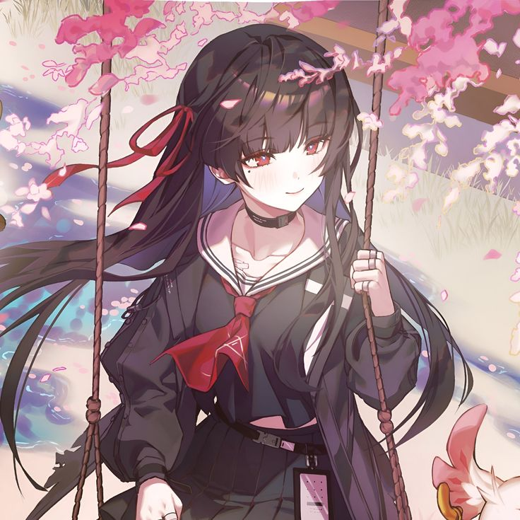

<div align="center">



 <p align="center">
  <a href="https://chat.whatsapp.com/FuyoDJWuOvM5g5HuU4SpT1" target="_blank">
    
  </a>
</p>

```

 ▒█▀▀█ ▒█░▒█ ▀█▀ ▒█▀▀▀█ ░█▀▀█ 
 ▒█░░░ ▒█▀▀█ ▒█░ ░▀▀▀▄▄ ▒█▄▄█ 
▒█▄▄█ ▒█░▒█ ▄█▄ ▒█▄▄▄█ ▒█░▒█

```

**Advanced WhatsApp Bot · Built by SIFAT**


</div>

---

```
$ info
  name     → CHISA
  version  → v1.0.0
  engine   → wp-heart
  runtime  → Node.js 20+
  author   → SIFAT
  license  → MIT
```

---

## // FEATURES

| Category | Capabilities |
|---|---|
| 🤖 **AI** | ChatGPT · Gemini · Claude · Vision · Code · Translate · Summarize |
| 📥 **Media** | YouTube · TikTok · Instagram · Spotify · Facebook · Twitter |
| 👥 **Group** | Anti-spam · Anti-link · Anti-toxic · Warn system · Auto-welcome |
| 🎨 **Maker** | Sticker · Image style · Image edit · Text effects |
| 💰 **Economy** | Coins · Premium · Sewa (subscription) system |
| ⚙️ **Owner** | Broadcast · Ban/Unban · Mode · Eval · Shell · CheckAPIs |

---

## // QUICK START

```bash
# 1. Install
npm install --legacy-peer-deps

# 2. Configure settings.json
{
  "bot":   { "name": "CHISA", "phoneNumber": "880XXXXXXXXXX" },
  "owner": { "name": "SIFAT", "id": "880XXXXXXXXXX" }
}

# 3. Run
node chisa.js

# 4. Open dashboard → http://localhost:5000
#    Click "REQUEST PAIRING CODE" → enter in WhatsApp
```

---

## // STRUCTURE

```
chisa/
├── chisa.js              ← entry point
├── settings.json         ← bot config
├── commands/
│   ├── cmd/              ← all command modules
│   └── event/            ← event handlers
├── src/
│   ├── core/wp-heart/    ← WA engine
│   ├── handlers/         ← message · reaction · member
│   └── web/status.js     ← dashboard UI
├── public/               ← chisa images + thumbnail
├── session/              ← WA auth (do not delete)
└── data/                 ← user · group · bot db
```

---

## // ROLE SYSTEM

```
Role 0  →  All users          (general commands)
Role 1  →  Group admins       (group management)
Role 2  →  Bot owner / co     (full control)
```

---

## // DEPLOY

```bash
# Railway / Render
# → Auto-detected via railway.json / render.yaml
# → Mount /session as persistent volume to keep auth alive

# Docker
docker build -t chisa . && \
docker run -d -p 5000:5000 -v $(pwd)/session:/app/session chisa
```

---

<div align="center">

made with ♥ by **[SIFAT](https://github.com/FX-SIFAT)**

</div>
